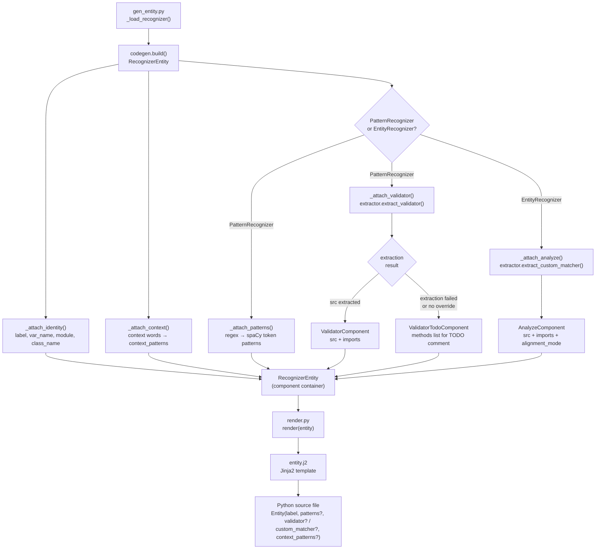
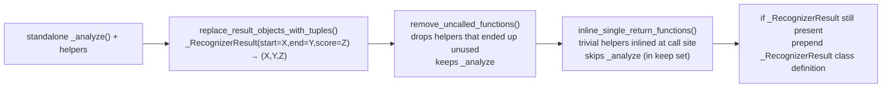

# gen_entity.py

Generates a native maskpipe `Entity` file from a Presidio `PatternRecognizer` or `EntityRecognizer`. The output is a ready-to-use Python source file that imports no Presidio types and integrates directly into the maskpipe spaCy pipeline.

---

## Usage

```bash
# By dotted class path
uv run python scripts/gen_entity.py presidio_analyzer.predefined_recognizers.us.UsSsnRecognizer

# By class name (searches all EntityRecognizer subclasses)
uv run python scripts/gen_entity.py UsSsnRecognizer

# Flags
uv run python scripts/gen_entity.py UsSsnRecognizer --out src/maskpipe/entities/us/ssn.py
uv run python scripts/gen_entity.py UsSsnRecognizer --stdout      # print instead of write
uv run python scripts/gen_entity.py UsSsnRecognizer --force       # overwrite existing file
uv run python scripts/gen_entity.py UsSsnRecognizer --context-boost 0.4  # default: 0.35
```

---

## Output path

Derived from the entity label, not the recognizer class name. Country prefixes are stripped automatically:

| Label | Output path |
|---|---|
| `CREDIT_CARD` | `src/maskpipe/entities/generated/credit_card.py` |
| `US_SSN` | `src/maskpipe/entities/us/ssn.py` |
| `AU_ABN` | `src/maskpipe/entities/australia/abn.py` |
| `FI_PERSONAL_IDENTITY_CODE` | `src/maskpipe/entities/finland/personal_identity_code.py` |

---

## Architecture

The pipeline follows an **ECS (Entity Component System)** design: entities are typed component containers, components are pure data, and systems attach one component each. Rendering is fully separated into a Jinja2 template.

```
┌─────────────────────────────────────────────────────────────────────┐
│  codegen.py                                                         │
│                                                                     │
│   RecognizerEntity          Components (pure dataclasses)           │
│   ┌──────────────┐          ┌─────────────────────────────────┐     │
│   │ _components  │          │ IdentityComponent               │     │
│   │  dict[type,  │  attach  │ PatternsComponent               │     │
│   │   Any]       │◄─────────│ ContextComponent                │     │
│   │              │          │ ValidatorComponent              │     │
│   │  .attach(c)  │          │ ValidatorTodoComponent          │     │
│   │  .get(T)     │          │ AnalyzeComponent                │     │
│   └──────┬───────┘          └─────────────────────────────────┘     │
│          │                                                           │
│          │ build()   runs _attach_* systems                         │
│          ▼                                                           │
│   ┌──────────────────────────────────────────────────────────┐      │
│   │  Systems                                                  │      │
│   │  _attach_identity   → always                             │      │
│   │  _attach_context    → always                             │      │
│   │  _attach_patterns   → PatternRecognizer only             │      │
│   │  _attach_validator  → PatternRecognizer only             │      │
│   │  _attach_analyze    → EntityRecognizer only              │      │
│   └──────────────────────────────────────────────────────────┘      │
└─────────────────────────────────────────────────────────────────────┘
          │
          │ generate() calls render()
          ▼
┌─────────────────────────────────────────────────────────────────────┐
│  render.py + templates/entity.j2                                    │
│                                                                     │
│  entity.get(IdentityComponent)   ──►  identity                      │
│  entity.get(PatternsComponent)   ──►  patterns                      │
│  entity.get(ContextComponent)    ──►  context                       │
│  entity.get(ValidatorComponent)  ──►  validator                     │
│  entity.get(ValidatorTodoComponent) ► validator_todo                │
│  entity.get(AnalyzeComponent)    ──►  analyze                       │
│  _build_imports_block(entity)    ──►  imports_block                 │
│                                                                     │
│  Jinja2 renders entity.j2 with these variables                      │
└─────────────────────────────────────────────────────────────────────┘
```

---

## High-level data flow



---

## Components

Each component is a `@dataclass` — pure data, no methods. `RecognizerEntity.get(T)` returns `None` when a component is absent, so the template handles all combinations without branching on recognizer type.

| Component | Attached by | Present when |
|---|---|---|
| `IdentityComponent` | `_attach_identity` | Always |
| `PatternsComponent` | `_attach_patterns` | PatternRecognizer |
| `ContextComponent` | `_attach_context` | Context words exist |
| `ValidatorComponent` | `_attach_validator` | Validator successfully extracted |
| `ValidatorTodoComponent` | `_attach_validator` | Validator exists but extraction failed |
| `AnalyzeComponent` | `_attach_analyze` | EntityRecognizer |

`ValidatorComponent` and `ValidatorTodoComponent` are mutually exclusive. `ValidatorComponent`/`ValidatorTodoComponent` and `AnalyzeComponent` are also mutually exclusive (only one recognizer type per entity).

---

## Rendering: Jinja2

`render.py` feeds the component data into `templates/entity.j2`. Adding a new component type requires:
1. A new `@dataclass` in `codegen.py`
2. A new `_attach_*` system in `codegen.py`
3. A new `` block in `entity.j2`
4. Pass `new_component=entity.get(NewComponent)` in `render.py`'s `render()` call

### Template variable logic

| Template variable | Source |
|---|---|
| `identity` | `IdentityComponent` |
| `patterns` | `PatternsComponent` or `None` |
| `context` | `ContextComponent` or `None` |
| `validator` | `ValidatorComponent` or `None` |
| `validator_todo` | `ValidatorTodoComponent` or `None` |
| `analyze` | `AnalyzeComponent` or `None` |
| `imports_block` | Assembled by `_build_imports_block()` |

### Template output structure

```
"""Entity generated from <module>.<class>."""

<imports_block>                         ← stdlib imports first, then third-party
from maskpipe.entities.entity import Entity

<validator_src or TODO comment>         ← only for PatternRecognizer

<analyze_src>                           ← only for EntityRecognizer
def _custom_matcher(doc: Doc) → ...    ← boilerplate, alignment_mode substituted

<var_name> = Entity(
    label="...",
    patterns=[...],                     ← PatternRecognizer only
    custom_matcher=_custom_matcher,     ← EntityRecognizer
    validator=_validator / None,        ← PatternRecognizer
    context_patterns=[...],             ← when context exists
)
```

### Registered Jinja2 filters

| Filter | Used on | What it does |
|---|---|---|
| `format_pattern` | `PatternsComponent.patterns` items | Formats a spaCy token pattern dict as a Python literal with proper indentation; uses `r"..."` raw strings for regexes |
| `format_context_pattern` | `ContextComponent.context_patterns` items | Formats a context pattern dict |

### Import sorting

`_build_imports_block` deduplicates all imports from `ValidatorComponent` and `AnalyzeComponent`, then sorts them with stdlib imports first (using `sys.stdlib_module_names`). Multi-line imports (e.g., `logging.getLogger` assignments) are appended last, each wrapped in blank lines.

---

## AST extraction pipeline

Both `extract_validator` and `extract_custom_matcher` drive the same core machinery in `extraction.py`. The goal is to produce a completely self-contained Python function with no Presidio imports.

```mermaid
flowchart LR
    SRC["inspect.getsource()"]
    SRC --> STRIP["Strip self param,\ndecorators, docstring\nRename function"]
    STRIP --> SELFATTR["SelfAttrInliner\nself.attr → live value literal"]
    SELFATTR --> PARAMS["LiteralParamInliner\n(analyze only)\nnlp_artifacts, entities → literals"]
    PARAMS --> SELFMETHOD["SelfMethodInliner\nself.method() → _method()\n(recursive extraction)"]
    SELFMETHOD --> PRESIDIO["PresidioReferenceInliner\nClass.method() → _method()\nClass.CONSTANT → literal\nRecognizerResult → _RecognizerResult\nOtherPresidioClass → SimpleNamespace"]
    PRESIDIO --> GLOBAL["GlobalConstantInliner\nmodule constants → literals"]
    GLOBAL --> IMPORTS["resolve_imports()\nfree names → import statements\nhandles aliases, Logger instances"]
    IMPORTS --> BOOL["wrap_bool_returns()\nambiguous returns → bool(...)"]
    BOOL --> CLEAN["remove_unused_imports()\nword-boundary check\nhandles 'import x as y' aliases"]
    CLEAN --> RESULT["standalone function(s) + imports"]
```



Extra passes in `extract_custom_matcher` only:



---

## Transformer reference

### Core transformers (`extraction.py` + `ast_utils.py`)

| Transformer | What it does |
|---|---|
| `SelfAttrInliner` | Replaces `self.supported_languages` etc. with their live values serialised via `repr()` |
| `LiteralParamInliner` | Inlines named function parameters as literal values (used to collapse `entities` and `nlp_artifacts` in `analyze`) |
| `SelfMethodInliner` | Extracts `self.method(args)` as a standalone `_method(args)` helper; recurses to handle nested self-calls |
| `PresidioReferenceInliner` | Removes all Presidio class references: static methods → helpers, constants → literals, `RecognizerResult(...)` → `_RecognizerResult(...)`, other Presidio types → `SimpleNamespace(...)`, `EntityRecognizer.remove_duplicates(x)` → `x` |
| `GlobalConstantInliner` | Inlines module-level constants (values with no importable origin) as literals |
| `ArgumentSubstitutor` | Substitutes named parameters with given AST nodes; used by `inline_single_return_functions` |

### Post-processing (`source_cleanup.py`)

| Pass | What it does |
|---|---|
| `wrap_bool_returns` | Wraps return expressions in `bool()` for functions annotated `-> bool` when the expression is not statically guaranteed to be bool (e.g. `re.match(...)`) |
| `replace_result_objects_with_tuples` | `_RecognizerResult(start=X, end=Y, score=Z)` → `(X, Y, Z)` |
| `remove_uncalled_functions` | Drops top-level functions that are never called; respects `keep` set |
| `inline_single_return_functions` | Inlines trivial one-liner helpers at their call sites; functions in `keep` are excluded from inlining |
| `remove_unused_imports` | Drops imports whose identifier no longer appears in the final source; uses word-boundary regex to avoid false positives on short names like `re`; alias-aware (`import x as y` → checks `y`) |

### Validator-specific transforms (`extract_validator.py`)

| Pass | What it does |
|---|---|
| `_adapt_first_param_to_span` | Changes `_validator(pattern_text: str, ...)` to `_validator(span: Span, ...)`, prepends `pattern_text = span.text`, forces return type to `-> bool` |
| `_inject_invalidate_check` | Inserts `if _invalidate(pattern_text): return False` after the `span.text` assignment, when both `validate_result` and `invalidate_result` are overridden |

### Import resolution (`ast_utils.resolve_imports`)

For each free name in the extracted function:
1. Presidio objects → skipped (they've been inlined or removed)
2. Modules → `import <name>` or `import <module> as <name>`
3. `logging.Logger` instances → `import logging\n<name> = logging.getLogger(__name__)`
4. Objects whose `__module__` starts with `_` → try the public alias (e.g. `_re` → `re`)
5. Everything else → `from <module> import <name>` if the object is re-exported from its module

---

## File map

```
scripts/
├── gen_entity.py                  CLI entry point; loads recognizer, resolves output path
├── codegen.py                     Components + RecognizerEntity + _attach_* systems + build()
├── render.py                      Jinja2 environment, filters, import assembly, render()
├── templates/
│   └── entity.j2                  Output template; all branching is Jinja2 conditionals
└── extractor/
    ├── __init__.py                re-exports extract_validator, extract_custom_matcher
    ├── extract_validator.py       PatternRecognizer → _validator(span: Span) -> bool
    ├── extract_custom_matcher.py  EntityRecognizer → _analyze(text) + _custom_matcher(doc)
    ├── extraction.py              SelfMethodInliner, PresidioReferenceInliner,
    │                              extract_instance_method, extract_static_method
    ├── ast_utils.py               SelfAttrInliner, LiteralParamInliner, GlobalConstantInliner,
    │                              ArgumentSubstitutor, free_names, local_names,
    │                              resolve_imports, drop_presidio_return_type
    └── source_cleanup.py          wrap_bool_returns, replace_result_objects_with_tuples,
                                   remove_uncalled_functions, inline_single_return_functions,
                                   remove_unused_imports, fix_blank_lines
```

---

## Adding support for a new recognizer type

If Presidio adds a third recognizer base class:

1. Add a new `@dataclass` component in `codegen.py` (e.g. `NewTypeComponent`)
2. Add `_attach_new_type(recognizer, converter, entity)` system
3. Add the branch to `build()` under the `isinstance` check
4. Add extractor logic in `extractor/` if needed
5. Pass the component to `render()` in `render.py`
6. Add `...` block in `entity.j2`

No existing code needs to change — new components simply pass through as `None` in existing template branches.
